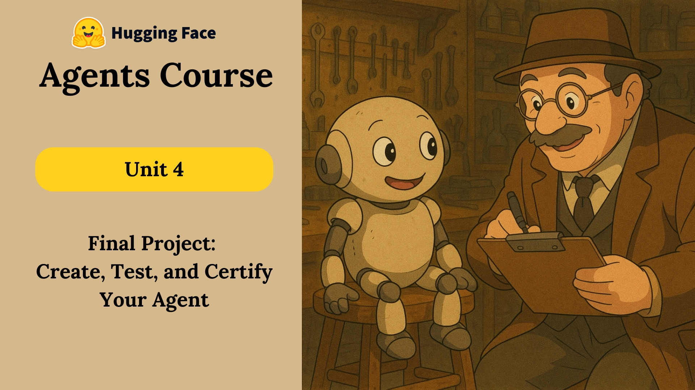

<br />
<div align="center">
  <a href="https://huggingface.co/learn/agents-course/unit4/introduction">
    
  </a>

  <h3 align="center">Agents Course Final Project</h3>

  <p align="center" style="width:80%">
    Final hands-on assignment for the Hugging Face Agents course. In this project I built a multi-agent solution, evaluated it against questions from the General AI Assistants (GAIA) benchmark (level one only), and got creative with some agent and tool improvements. 
</div>

## About The Project

Achieving 30 points for the certification was relatively easy with the template provided and a powerful enough LLM. However, evaluation revealed the unique types of implementation challenges with AI agents. Some of which include...

* Cost
* Reliability
* Response Times

[](https://huggingface.co/spaces/civerson916/Final_Assignment_Template)

[](https://huggingface.co/learn/agents-course/unit4/hands-on)

Beyond what looks like a smolagents guided tour, you can find the following in this repo... 

* Research agent armed with Google search via [Serper](https://serper.dev/) and both Audo and Video Understanding via [Gemini](https://ai.google.dev/gemini-api/docs/)
* Chess agent leveraging my [board_to_fen](https://github.com/civerson/board_to_fen) fork and a Stockfish API.
* [Langfuse](https://langfuse.com/) setup boilerplate, a working example. This is an absolute must.
* [Pydantic](https://docs.pydantic.dev/latest/) settings for type safety, centralized, and encapsulated config.
* Basic parallel agent task execution, compatible with [smolagents](https://huggingface.co/docs/smolagents/main/en/index) and the [Gradio](https://www.gradio.app/) UI.


## Getting Started

To get a local copy up and running follow these steps.

### Prerequisites

* python
* pip
* git

### Installation

1. Get an API key for the following services: [OpenRouter](https://openrouter.ai/), [Gemini](https://ai.google.dev/gemini-api/docs/api-key), [Serper](https://serper.dev/), and [Langfuse](https://langfuse.com/). The HF username and space are only used when submitting answers for evaluation, but must be present to startup. If you run this in your own HF space, these will already be set for you. 
2. Clone the repo and install packages
   ```sh
   git clone https://github.com/civerson/smolagents-gaia-final.git
   pip install -r requirements.txt
   ```
3. Enter your API keys in a `.env` or set them as follows
   ```sh
   OPENROUTER_API_KEY = 'ENTER YOUR API'
   GEMINI_API_KEY = 'ENTER YOUR API'
   SERPER_API_KEY = 'ENTER YOUR API'
   LANGFUSE_PUBLIC_KEY = 'ENTER YOUR API'
   LANGFUSE_SECRET_KEY = 'ENTER YOUR API'
   USERNAME = 'ENTER YOUR HF USERNAME'
   SPACE_ID = 'ENTER YOUR HF SPACE'
   ```
4. Run the app
   ```sh
   python app.py
   ```
5. Change git remote url to avoid accidental pushes to base project
   ```sh
   git remote set-url origin github_username/repo_name
   git remote -v # confirm the changes
   ```

<p align="right">(<a href="#readme-top">back to top</a>)</p>

